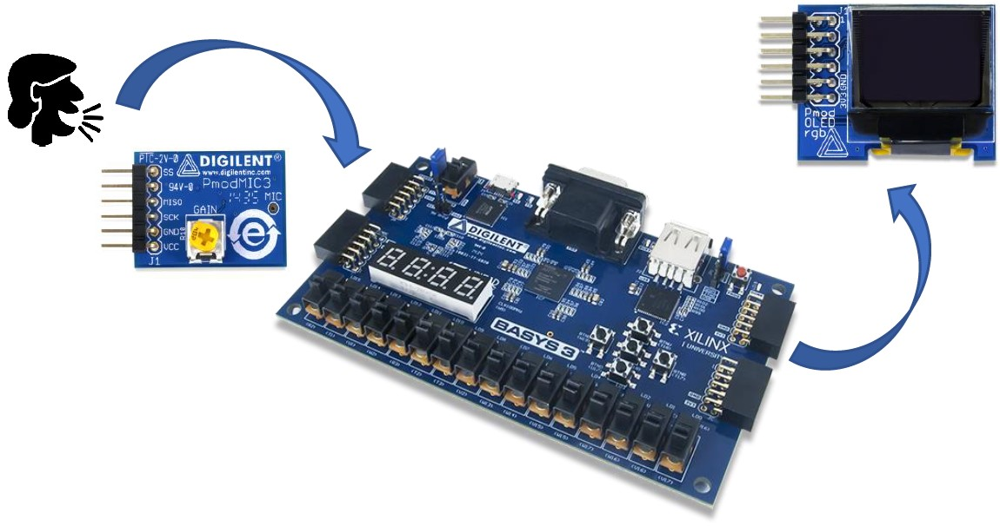
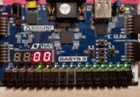
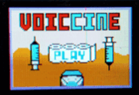
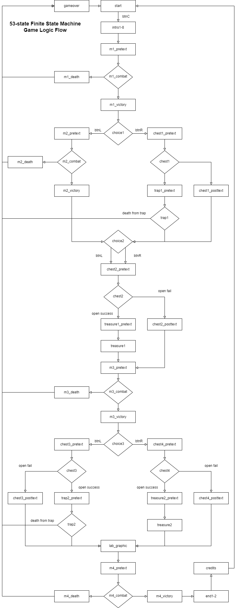

# VOICcinE: A 53-state Voice-Interfaced Verilog RPG

## Introduction
This project aims to create a Sound Display and Entertainment (SDE) system on the Basys3 FPGA with two additional devices provided for the system: 
* **MEMs microphone:** This analog-to-digital device will capture audio signals from the surroundings, and provides the data to you in a digital format
* **OLED RGB Display Screen:** Information can be displayed on this 96 x 64 bit display screen with 16-bit colour resolution

## Basic Tasks

  

The basic tasks for this project combines the use of the microphone to capture the volume of audio in order to output a volume bar on the OLED screen as well as the 7-segment display found on the Basys3 FPGA board. 

## VOICcinE: Custom Project Enhancement
Together with my partner, we were tasked to enhance the functionality of the system to utilize both audio and visuals for a unique, entertaining and technically-intensive entertainment system. There were almost no guidelines and was very open to imagination, only gated by technical prowess and time. 

Our initial ideations revolved around games and we eventually settled on making an role-playing game (RPG) that will use audio volume input as a creative way to both attack and defend against enemies and interact with in-game objects while of course simulatenously displaying the necessary information on both the OLED screen and the 7-segment display. All of these had to be programmed by hand using the hardware language, Verilog, on the Basys3 FPGA. 

At the time of the project, the Covid-19 pandemic was at its peak. Hence, we decided to incorporate it into the theme of our game, where we tell a story of a doctor on a journey towards finding the vaccine, battling other types of familiar viruses along the way and facing traps and treasures that may impede or aid her journey. 

### Technical Implementation and Gameplay

  

Pixel graphics were crucial in displaying texts and graphics onto the tiny screen. Design of these graphics were done using the pixel-drawing software, Aseprite, before converting them into Verilog code with the help of the `oled_alphabets.py` Python script. 

Gameplay consisted of choice selections using buttons on-board the FPGA along with object interactions and combat. Both required using audio as the input, where the volume corresponds to a value from 0-16. This value must match along a range of randomized values within a countdown time limit of a short few seconds. 

Randomization on the FPGA were implemented using a hardware "hack" or method by using the first few bits of the constant audio input, which are highly sensitive and variable, which fluctuates extensively and simulates randomness perfectly, even in environments that were seemingly quiet to us humans. 

As an example for the combat system, an enemy virus may randomly require a volume value range of 12-15 to count as a successful hit and likewise, a different range of 15-16 to count as a successful defense when it alternates to the virus's turn. 

Chests, which could either give treasures such as masks that would increase the player's health or spikes that would decrease it instead were also interacted with the same mechanics. 

The range becomes smaller along the way, increasing the difficulty in achieving a successful interaction within the time limit. Dying when the player loses all 6 health points brings up the gameover screen and the player will have to restart from the beginning. The entire game state flowchart can be seen below. 

### 53-State Finite State Machine

In total, there were 53 states, each with a unique graphic attached to it that the player could stumble upon. Coding the logic was challenging in Verilog, with the need to understand parallel programming and hardware design such as multiplexers for if-else statements. Simple lateral movement animations were also incorporated by shifting the x-coordinates of the viruses to enhance the immersion and flavour of the game. 

The player wins when she defeats the final boss, the Covid-19 virus! :)

## Conclusion
Overall, we were very proud of our accomplishment although further improvements in adding more animations such as flashes of white on player or enemy damage, similar to old Pokemon games, could have been achieved with more time. 

Despite the pretty extreme difficulty in working with the tough hardware language along with slow iterations due to the compile speed of the FPGA, this was an extremely great learning experience and we spent many sleepless nights to achieve the goal that we set for ourselves in creating a completed and entertaining game. 